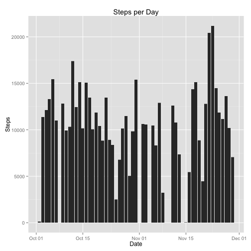
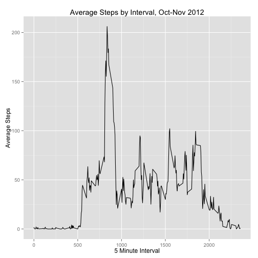
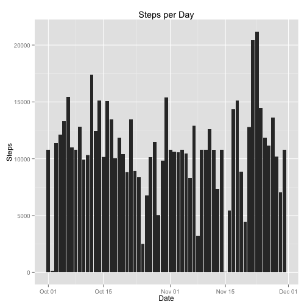
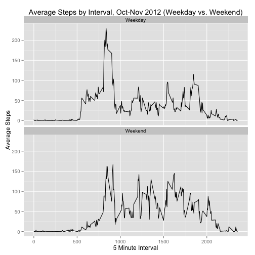

## Loading and preprocessing the data

1. Load the data (i.e. `read.csv()`)


```r
csvFile <- unzip("activity.zip", exdir = "./data")
activityData <- read.csv(csvFile)
```

2. Process/transform the data (if necessary) into a format suitable for analysis

Change the date format to a `Date` type


```r
activityData$date <- as.Date(activityData$date, format="%Y-%m-%d")
```

## What is mean total number of steps taken per day?

1. Make a histogram of the total number of steps taken each day

We can omit the missing data:


```r
activityData.complete  <- na.omit(activityData)
```

_Using `ggplot2` for figures:_


```r
library(ggplot2)
```

```
## Need help? Try the ggplot2 mailing list: http://groups.google.com/group/ggplot2.
```

```r
g <- ggplot(activityData.complete, aes(x=date, y=steps))
g <- g + geom_histogram(stat="identity")
g <- g + labs(x="Date", y="Steps", title="Steps per Day")
print(g)
```

 

2. Calculate and report the *mean* and *median* total number of steps taken per day


```r
totals <- tapply(activityData.complete$steps, activityData.complete$date, FUN = sum)
mean(totals)
```

```
## [1] 10766
```

```r
median(totals)
```

```
## [1] 10765
```

## What is the average daily activity pattern?

1. Make a time series plot (i.e. `type = "l"`) of the 5-minute interval (x-axis) and the average number of steps taken, averaged across all days (y-axis)

_Note: using `ggplot2` for plotting. I could have easily used `plot(intervalSummary, type="l",xlab="5 Minute Interval",ylab="Average Steps"))`_


```r
library(plyr)
intervalSummary <- ddply(activityData.complete, ~ interval, summarise, avgsteps=mean(steps))

g <- ggplot(intervalSummary, aes(x=interval, y=avgsteps))
g <- g + geom_line() 
g <- g + labs(x="5 Minute Interval", y="Average Steps", title="Average Steps by Interval, Oct-Nov 2012")
print(g)
```

 

2. 2 Which 5-minute interval, on average across all the days in the dataset, contains the maximum number of steps?


```r
intervalSummary[which.max(intervalSummary$avgsteps),"interval"]
```

```
## [1] 835
```

## Imputing missing values

1. Calculate and report the total number of missing values in the dataset (i.e. the total number of rows with NAs)


```r
nrow(activityData[is.na(activityData),])
```

```
## [1] 2304
```

2. Devise a strategy for filling in all of the missing values in the dataset. 

To impute the missing values in our dataset, we're going to use the mean value of the 5-minute interval, using `intervalSummary` as a lookup table.


```r
activityData.missing <- activityData[is.na(activityData),]
activityData.missing$steps <- sapply(activityData.missing$interval, function(x) {
  round(intervalSummary[intervalSummary$interval==x,"avgsteps"])
  })
```

3. Create a new dataset that is equal to the original dataset but with the missing data filled in.


```r
activityData.imputed <- rbind(activityData.complete, activityData.missing)
```

4. Make a histogram of the total number of steps taken each day 


```r
g <- ggplot(activityData.imputed, aes(x=date, y=steps))
g <- g + geom_histogram(stat="identity")
g <- g + labs(x="Date", y="Steps", title="Steps per Day")
print(g)
```

 

and calculate and report the mean and median total number of steps taken per day. 


```r
totals.imputed <- tapply(activityData.imputed$steps, activityData.imputed$date, FUN = sum)
mean(totals.imputed)
```

```
## [1] 10766
```

```r
median(totals.imputed)
```

```
## [1] 10762
```

Do these values differ from the estimates from the first part of the assignment? What is the impact of imputing missing data on the estimates of the total daily number of steps?


```r
library(xtable)
totals.summary <- data.frame(mean = c(mean(totals), mean(totals.imputed)), median = c(median(totals), median(totals.imputed)))
row.names(totals.summary) <- c("Original","Imputed")

totals.html <- xtable(totals.summary)
print(totals.html, type="html", html.table.attributes="border=1 width=420")
```

<!-- html table generated in R 3.1.1 by xtable 1.7-4 package -->
<!-- Sun Nov  9 14:16:41 2014 -->
<table border=1 width=420>
<tr> <th>  </th> <th> mean </th> <th> median </th>  </tr>
  <tr> <td align="right"> Original </td> <td align="right"> 10766.19 </td> <td align="right"> 10765.00 </td> </tr>
  <tr> <td align="right"> Imputed </td> <td align="right"> 10765.64 </td> <td align="right"> 10762.00 </td> </tr>
   </table>

## Are there differences in activity patterns between weekdays and weekends?

1. Create a new factor variable in the dataset with two levels – “weekday” and “weekend” indicating whether a given date is a weekday or weekend day.


```r
activityData.imputed <- mutate(activityData.imputed, weekday = as.factor(ifelse(weekdays(date) %in% c("Saturday","Sunday"), "Weekend", "Weekday")))
```

2. Make a panel plot containing a time series plot (i.e. `type = "l"`) of the 5-minute interval (x-axis) and the average number of steps taken, averaged across all weekday days or weekend days (y-axis).

_Note: Using `ggplot2` for aesthetic consistency._


```r
intervalSummary.days <- ddply(activityData.imputed, weekday ~ interval, summarise, steps=mean(steps))
g <- ggplot(intervalSummary.days, aes(x=interval, y=steps))
g <- g + geom_line() 
g <- g + facet_wrap( ~ weekday, ncol=1)
g <- g + labs(x="5 Minute Interval", y="Average Steps", title="Average Steps by Interval, Oct-Nov 2012 (Weekday vs. Weekend)")
print(g)
```

 
